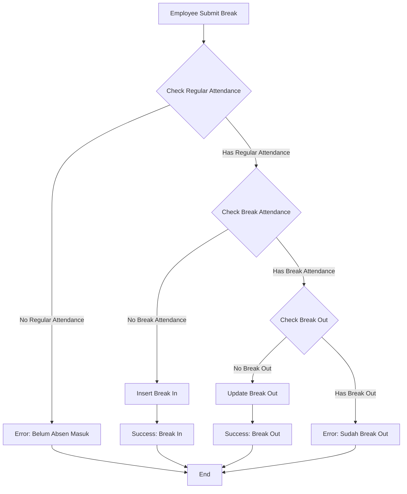

# Attendance Break Validation Logic

## 📋 Overview

Sistem absen istirahat (break) sekarang memiliki validasi yang ketat untuk memastikan urutan absen yang benar dan mencegah absen yang tidak valid.

## 🔄 Flow Validasi

### 1. Validasi Absen Masuk

**Kondisi:** Sebelum melakukan absen istirahat, employee harus sudah melakukan absen masuk (check-in).

**Logic:**
```typescript
// Cek apakah sudah ada absen masuk hari ini
const regularAttendance = await trx(`${namaDatabaseDynamic}.attendance`)
  .where({ 
    em_id: dto.em_id, 
    atten_date: dto.tanggal_absen 
  })
  .whereNotNull('signin_time')
  .where('signin_time', '!=', '00:00:00')
  .orderBy('id', 'desc')
  .first();

if (!regularAttendance) {
  return {
    status: false,
    message: 'Anda belum memiliki absen masuk hari ini. Silakan absen masuk terlebih dahulu.',
    data: null,
  };
}
```

**Response Error:**
```json
{
  "status": false,
  "message": "Anda belum memiliki absen masuk hari ini. Silakan absen masuk terlebih dahulu.",
  "data": null
}
```

### 2. Validasi Break In

**Kondisi:** Jika belum ada absen istirahat, employee dapat melakukan break in.

**Logic:**
```typescript
// Cek apakah sudah ada absen istirahat
const breakAttendance = await trx(`${namaDatabaseDynamic}.attendance`)
  .where({ 
    em_id: dto.em_id, 
    atten_date: dto.tanggal_absen 
  })
  .whereNotNull('breakin_time')
  .where('breakin_time', '!=', '00:00:00')
  .orderBy('id', 'desc')
  .first();

if (!breakAttendance) {
  // Insert break in
  await trx(`${namaDatabaseDynamic}.attendance`).insert(insertData);
  return {
    status: true,
    message: 'berhasil kirim absen istirahat masuk',
    data: { ... }
  };
}
```

**Response Success:**
```json
{
  "status": true,
  "message": "berhasil kirim absen istirahat masuk",
  "data": {
    "em_id": "EMP001",
    "atten_date": "2024-01-15",
    "breakin_time": "12:00:00",
    "breakout_time": "00:00:00",
    "place_break_in": "Main Office",
    "breakin_longlat": "-6.2088,106.8456",
    "breakin_pict": "abc123150120241200.png",
    "breakin_note": "Break time",
    "breakin_addr": "Office Building",
    "image_uploaded": true,
    "image_path": "/foto_absen/company/abc123150120241200.png",
    "original_filename": "photo.png",
    "file_size": 1024000
  }
}
```

### 3. Validasi Break Out

**Kondisi:** Jika sudah ada break in, employee dapat melakukan break out.

**Logic:**
```typescript
if (!breakAttendance.breakout_time || breakAttendance.breakout_time === '00:00:00') {
  // Update break out
  await trx(`${namaDatabaseDynamic}.attendance`)
    .where({ id: breakAttendance.id })
    .update({
      breakout_time: jamKeluar,
      place_break_out: lokasiAbsenOut,
      breakout_longlat: latLangOut,
      breakout_pict: gambarKeluar,
      breakout_note: catatanKeluar,
      breakout_addr: lokasiKeluar,
    });
  return {
    status: true,
    message: 'berhasil kirim absen istirahat keluar',
    data: { ... }
  };
}
```

**Response Success:**
```json
{
  "status": true,
  "message": "berhasil kirim absen istirahat keluar",
  "data": {
    "em_id": "EMP001",
    "atten_date": "2024-01-15",
    "breakin_time": "12:00:00",
    "breakout_time": "13:00:00",
    "place_break_in": "Main Office",
    "place_break_out": "Main Office",
    "breakin_longlat": "-6.2088,106.8456",
    "breakout_longlat": "-6.2088,106.8456",
    "breakin_pict": "abc123150120241200.png",
    "breakout_pict": "abc123150120241300.png",
    "breakin_note": "Break time",
    "breakout_note": "Break time",
    "breakin_addr": "Office Building",
    "breakout_addr": "Office Building",
    "image_uploaded": true,
    "image_path": "/foto_absen/company/abc123150120241300.png",
    "original_filename": "photo.png",
    "file_size": 1024000
  }
}
```

### 4. Validasi Break Ganda

**Kondisi:** Jika sudah break out, employee tidak dapat melakukan absen istirahat lagi.

**Logic:**
```typescript
if (breakAttendance.breakout_time && breakAttendance.breakout_time !== '00:00:00') {
  return {
    status: false,
    message: 'Anda sudah istirahat keluar. Tidak dapat melakukan absen istirahat lagi.',
    data: null,
  };
}
```

**Response Error:**
```json
{
  "status": false,
  "message": "Anda sudah istirahat keluar. Tidak dapat melakukan absen istirahat lagi.",
  "data": null
}
```

## 📊 State Machine



## 🎯 Validasi Rules

### ✅ Valid Scenarios

1. **Break In (Pertama kali):**
   - ✅ Sudah absen masuk
   - ✅ Belum ada absen istirahat
   - ✅ Result: Break in berhasil

2. **Break Out:**
   - ✅ Sudah absen masuk
   - ✅ Sudah break in
   - ✅ Belum break out
   - ✅ Result: Break out berhasil

### ❌ Invalid Scenarios

1. **Belum Absen Masuk:**
   - ❌ Belum ada absen masuk hari ini
   - ❌ Result: Error "Anda belum memiliki absen masuk hari ini"

2. **Sudah Break Out:**
   - ❌ Sudah break in dan break out
   - ❌ Result: Error "Anda sudah istirahat keluar"

3. **Multiple Break Sessions:**
   - ❌ Sistem tidak mendukung multiple break sessions
   - ❌ Hanya satu break session per hari

## 🔧 Database Schema

### Attendance Table Fields untuk Break

| Field | Type | Description |
|-------|------|-------------|
| `breakin_time` | TIME | Waktu break in |
| `breakout_time` | TIME | Waktu break out |
| `place_break_in` | VARCHAR | Lokasi break in |
| `place_break_out` | VARCHAR | Lokasi break out |
| `breakin_longlat` | VARCHAR | GPS break in |
| `breakout_longlat` | VARCHAR | GPS break out |
| `breakin_pict` | VARCHAR | Foto break in |
| `breakout_pict` | VARCHAR | Foto break out |
| `breakin_note` | TEXT | Catatan break in |
| `breakout_note` | TEXT | Catatan break out |
| `breakin_addr` | VARCHAR | Alamat break in |
| `breakout_addr` | VARCHAR | Alamat break out |

## 📝 API Response Examples

### Success Responses

#### Break In Success
```json
{
  "status": true,
  "message": "berhasil kirim absen istirahat masuk",
  "data": {
    "em_id": "EMP001",
    "atten_date": "2024-01-15",
    "breakin_time": "12:00:00",
    "breakout_time": "00:00:00",
    "place_break_in": "Main Office",
    "breakin_longlat": "-6.2088,106.8456",
    "breakin_pict": "abc123150120241200.png",
    "breakin_note": "Lunch break",
    "breakin_addr": "Office Building",
    "image_uploaded": true,
    "image_path": "/foto_absen/company/abc123150120241200.png",
    "original_filename": "photo.png",
    "file_size": 1024000
  }
}
```

#### Break Out Success
```json
{
  "status": true,
  "message": "berhasil kirim absen istirahat keluar",
  "data": {
    "em_id": "EMP001",
    "atten_date": "2024-01-15",
    "breakin_time": "12:00:00",
    "breakout_time": "13:00:00",
    "place_break_in": "Main Office",
    "place_break_out": "Main Office",
    "breakin_longlat": "-6.2088,106.8456",
    "breakout_longlat": "-6.2088,106.8456",
    "breakin_pict": "abc123150120241200.png",
    "breakout_pict": "abc123150120241300.png",
    "breakin_note": "Lunch break",
    "breakout_note": "Lunch break",
    "breakin_addr": "Office Building",
    "breakout_addr": "Office Building",
    "image_uploaded": true,
    "image_path": "/foto_absen/company/abc123150120241300.png",
    "original_filename": "photo.png",
    "file_size": 1024000
  }
}
```

### Error Responses

#### Belum Absen Masuk
```json
{
  "status": false,
  "message": "Anda belum memiliki absen masuk hari ini. Silakan absen masuk terlebih dahulu.",
  "data": null
}
```

#### Sudah Break Out
```json
{
  "status": false,
  "message": "Anda sudah istirahat keluar. Tidak dapat melakukan absen istirahat lagi.",
  "data": null
}
```

## 🎯 Best Practices

### 1. Urutan Absen yang Benar
1. **Absen Masuk** (check-in)
2. **Break In** (istirahat masuk)
3. **Break Out** (istirahat keluar)
4. **Absen Keluar** (check-out)

### 2. Validasi Client Side
- Implementasikan validasi di client untuk memberikan feedback yang lebih baik
- Tampilkan status absen saat ini kepada user
- Disable tombol yang tidak valid

### 3. Error Handling
- Tangani semua error response dengan proper UI feedback
- Berikan pesan yang jelas dan actionable
- Log semua error untuk debugging

### 4. Testing Scenarios
- Test semua validasi scenarios
- Test error handling
- Test dengan data yang tidak valid
- Test dengan multiple users

## 📊 Monitoring

### Logs yang Dicatat
- ✅ Break in berhasil
- ✅ Break out berhasil
- ❌ Error: Belum absen masuk
- ❌ Error: Sudah break out
- ❌ Database errors

### Metrics yang Dimonitor
- Jumlah break in per hari
- Jumlah break out per hari
- Error rate untuk validasi
- Average break duration
- Break patterns per employee

## 🔄 Future Enhancements

### Planned Features
- [ ] Multiple break sessions per day
- [ ] Break duration limits
- [ ] Break time restrictions
- [ ] Break approval workflow
- [ ] Break analytics and reporting
- [ ] Break notifications
- [ ] Break integration with payroll 