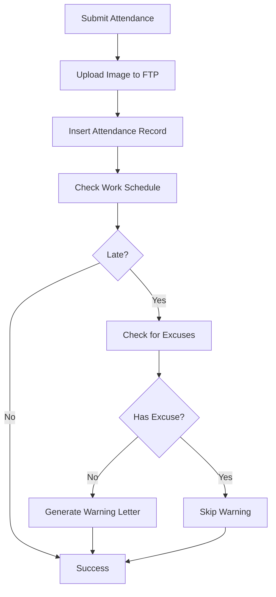
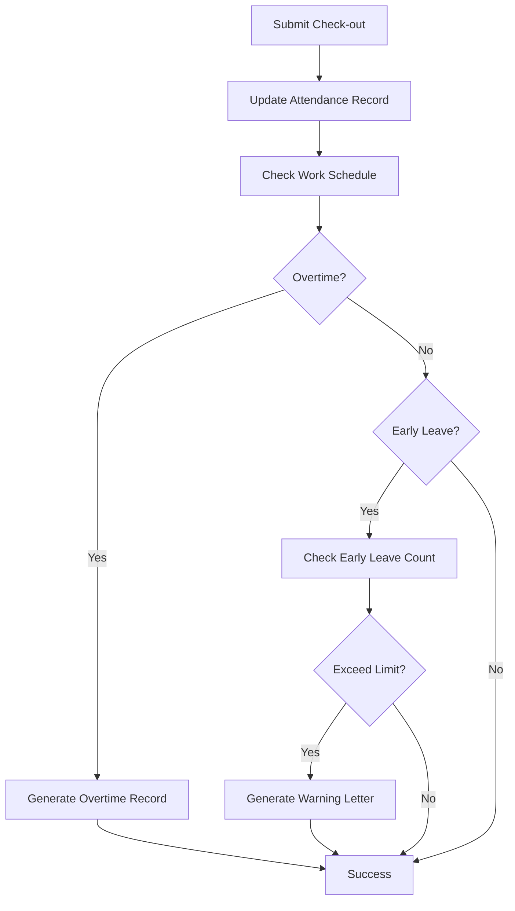

# Submit Attendance Service - Quick Reference

## 📋 Overview

Service untuk menangani submission attendance dengan fitur:
- ✅ Upload gambar ke FTP
- ✅ Deteksi keterlambatan otomatis
- ✅ Perhitungan lembur otomatis
- ✅ Pembuatan surat peringatan
- ✅ Support multi-tenant

## 🚀 Quick Start

### Basic Usage

```typescript
// Controller
@Post('submit')
@UseInterceptors(FileInterceptor('image'))
async submitAttendance(
  @Query('tenant') tenant: string,
  @Query('em_id') emId: string,
  @Body() dto: SubmitAttendanceFormDataDto,
  @UploadedFile() image?: any,
): Promise<any> {
  const attendanceDto = {
    database: tenant,
    em_id: emId,
    tanggal_absen: dto.tanggal_absen || getDateNow(),
    reg_type: dto.reg_type || 1,
    type_attendance: dto.type_attendance,
    location: dto.location,
    note: dto.note,
    lat_lang: dto.lat_lang,
    place: dto.place,
    category: dto.category,
    image,
  };
  
  return this.submitAttendanceService.submitAttendance(attendanceDto);
}
```

### Client Request

```bash
curl -X POST "http://localhost:3000/attendances/submit?tenant=company&em_id=EMP001" \
  -H "Authorization: Bearer <token>" \
  -F "image=@photo.png" \
  -F "reg_type=1" \
  -F "type_attendance=1" \
  -F "location=Office Building" \
  -F "note=Check in for work" \
  -F "lat_lang=-6.2088,106.8456" \
  -F "place=Main Office"
```

## 📝 Interfaces

### AttendanceFormDataDto

```typescript
interface AttendanceFormDataDto {
  database: string;           // Database tenant
  em_id: string;             // Employee ID
  tanggal_absen: string;     // Date (YYYY-MM-DD)
  reg_type: number;          // 0 = no image, 1 = with image
  type_attendance?: string;  // 1 = check-in, 2 = check-out
  location?: string;         // Location string
  note?: string;            // Note
  lat_lang?: string;        // GPS coordinates
  place?: string;           // Place name
  category?: string;        // Category
  image?: FileUpload;       // Uploaded file
}
```

### FileUpload

```typescript
interface FileUpload {
  fieldname: string;      // FormData field name
  originalname: string;   // Original filename
  encoding: string;       // File encoding
  mimetype: string;       // MIME type
  size: number;          // File size in bytes
  buffer: Buffer;        // File buffer
  destination?: string;   // Destination path
  filename?: string;      // Generated filename
  path?: string;         // File path
}
```

## 🔧 Methods

### Public Methods

| Method | Description | Parameters |
|--------|-------------|------------|
| `submitAttendance()` | Main attendance submission | `AttendanceFormDataDto` |
| `getAttendanceById()` | Get attendance by ID | `id, database` |
| `updateAttendanceById()` | Update attendance | `id, dto, database` |
| `deleteAttendanceById()` | Delete attendance | `id, database` |

### Private Methods

| Method | Description |
|--------|-------------|
| `handleLateAttendance()` | Handle late detection |
| `handleOvertimeLogic()` | Handle overtime calculation |
| `handleEarlyLeaveLogic()` | Handle early leave detection |
| `generateWarningLetter()` | Generate warning letter |
| `generateOvertimeRecord()` | Generate overtime record |

## 📊 Response Format

### Success Response

```json
{
  "status": true,
  "message": "berhasil kirim absen",
  "title": "",
  "is_show_notif": false,
  "deskription": "",
  "status_absen": "",
  "data": {
    "em_id": "EMP001",
    "atten_date": "2024-01-15",
    "signin_time": "08:00:00",
    "signout_time": "00:00:00",
    "place_in": "Main Office",
    "place_out": "",
    "signin_longlat": "-6.2088,106.8456",
    "signout_longlat": "",
    "signin_pict": "abc123150120240800.png",
    "signout_pict": "",
    "signin_note": "Check in for work",
    "signout_note": "",
    "signin_addr": "Office Building",
    "signout_addr": "",
    "atttype": 0,
    "reg_type": 1,
    "image_uploaded": true,
    "image_path": "/foto_absen/company/abc123150120240800.png",
    "original_filename": "photo.png",
    "file_size": 1024000
  }
}
```

### Error Response

```json
{
  "statusCode": 500,
  "message": "Gagal kirim absen",
  "error": "Internal Server Error"
}
```

## 🗄️ Database Tables

### Attendance Table

```sql
CREATE TABLE attendance (
  id INT PRIMARY KEY AUTO_INCREMENT,
  em_id VARCHAR(50) NOT NULL,
  atten_date DATE NOT NULL,
  signin_time TIME DEFAULT '00:00:00',
  signout_time TIME DEFAULT '00:00:00',
  place_in VARCHAR(255),
  place_out VARCHAR(255),
  signin_longlat VARCHAR(100),
  signout_longlat VARCHAR(100),
  signin_pict VARCHAR(255),
  signout_pict VARCHAR(255),
  signin_note TEXT,
  signout_note TEXT,
  signin_addr VARCHAR(255),
  signout_addr VARCHAR(255),
  atttype INT DEFAULT 0,
  reg_type INT DEFAULT 0
);
```

### Employee Letter Table

```sql
CREATE TABLE employee_letter (
  id INT PRIMARY KEY AUTO_INCREMENT,
  nomor VARCHAR(50) NOT NULL,
  tgl_surat DATE NOT NULL,
  em_id VARCHAR(50) NOT NULL,
  letter_id VARCHAR(50) NOT NULL,
  eff_date DATE NOT NULL,
  status VARCHAR(50) DEFAULT 'Pending',
  title VARCHAR(255),
  alasan TEXT
);
```

### Emp Labor Table (Overtime)

```sql
CREATE TABLE emp_labor (
  id INT PRIMARY KEY AUTO_INCREMENT,
  nomor_ajuan VARCHAR(50) NOT NULL,
  em_id VARCHAR(50) NOT NULL,
  branch_id VARCHAR(50),
  dari_jam TIME,
  sampai_jam TIME,
  atten_date DATE,
  alasan TEXT,
  status VARCHAR(50) DEFAULT 'Pending',
  durasi INT,
  lokasi VARCHAR(255)
);
```

## ⚙️ Configuration

### System Settings (sysdata table)

| Code | Description | Default |
|------|-------------|---------|
| `S01` | Max late count | 3 |
| `020` | Late warning threshold | 3 |
| `041` | Overtime enabled | 1 |
| `042` | Overtime settings | 1 |
| `S02` | Max early leave count | 3 |

### FTP Configuration

```typescript
// config/sftp.service.ts
@Injectable()
export class SftpService {
  async connect(): Promise<void>
  async uploadFile(localPath: string, remotePath: string): Promise<void>
  async disconnect(): Promise<void>
}
```

## 🔍 Logic Flow

### Check-in Flow



### Check-out Flow



## 🛠️ Error Handling

### Common Errors

| Error | Cause | Solution |
|-------|-------|----------|
| `Missing required parameters` | Missing database/em_id | Add required parameters |
| `Error uploading image to FTP` | FTP connection failed | Check FTP server |
| `Attendance tidak ditemukan` | Invalid attendance ID | Check attendance ID |
| `Database connection error` | Database config issue | Check database config |

### Error Handling Pattern

```typescript
try {
  // Database operations
  await trx.commit();
  return successResponse;
} catch (error) {
  await trx.rollback();
  console.error('❌ Error:', error);
  throw new InternalServerErrorException('Error message', error.message);
}
```

## 📈 Features

### ✅ Implemented Features

- [x] FormData file upload
- [x] FTP image upload
- [x] Late detection
- [x] Overtime calculation
- [x] Early leave detection
- [x] Warning letter generation
- [x] Multi-tenant support
- [x] Transaction handling
- [x] Error handling
- [x] Logging

### 🔄 Planned Features

- [ ] Push notification
- [ ] Email notification
- [ ] SMS notification
- [ ] Attendance analytics
- [ ] Report generation
- [ ] Mobile app integration

## 📚 Dependencies

```typescript
import { Injectable, InternalServerErrorException } from '@nestjs/common';
import { DbService } from '../../../config/database.service';
import { SftpService } from '../../../config/sftp.service';
import { FcmService } from '../../../common/fcm.service';
import randomstring from 'randomstring';
import { formatDbNameNow, getDateNow } from 'src/common/utils';
import * as fs from 'fs';
import * as path from 'path';
```

## 🎯 Best Practices

1. **Always use transactions** for database operations
2. **Handle errors properly** with try-catch and rollback
3. **Validate input data** before processing
4. **Log important events** for debugging
5. **Use TypeScript interfaces** for type safety
6. **Clean up temporary files** after upload
7. **Check file size and format** before upload
8. **Use proper HTTP status codes** for responses

## 🔧 Troubleshooting

### File Upload Issues

```bash
# Check FTP connection
telnet ftp-server 22

# Check file permissions
ls -la /tmp/

# Check disk space
df -h
```

### Database Issues

```sql
-- Check database connection
SELECT 1;

-- Check table structure
DESCRIBE attendance;

-- Check data
SELECT * FROM attendance LIMIT 5;
```

### Late Detection Issues

```sql
-- Check work schedule
SELECT * FROM emp_shift WHERE em_id = 'EMP001';

-- Check system settings
SELECT * FROM sysdata WHERE kode IN ('S01', '020');
```

## 📝 Notes

- Service supports both check-in and check-out
- Images are automatically uploaded to FTP server
- Warning letters are generated automatically
- Overtime is calculated based on work schedule
- All operations use database transactions
- Multi-tenant support with dynamic database names
- Comprehensive error handling and logging 